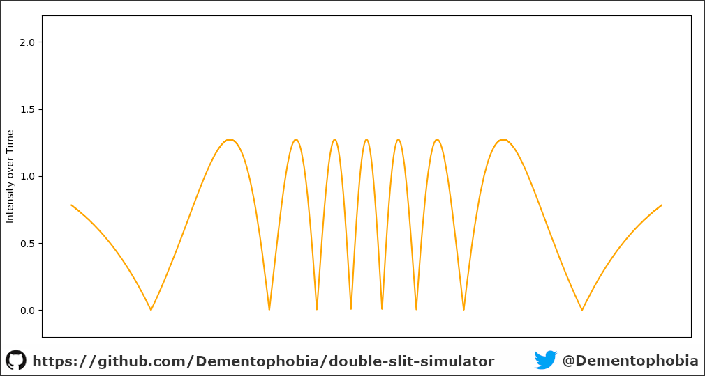
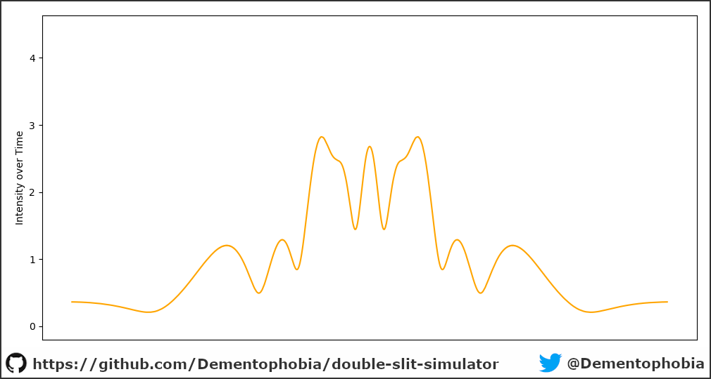

# Implementing the Double-Slit experiment in Python

There are many different ways to approach the famous [double-slit experiment](https://en.wikipedia.org/wiki/Double-slit_experiment). As a practitioner of physics, you can build it in your lab. As a mathematician, you can analyze the underlying formulas and derive a solution. Me, as a programmer, I prefer to simulate it. And Python is a great programming language to do so, because it gives us access to powerful libraries like numpy and matplotlib.

You can find my source code of the simulator I've created in a single file: [interference_simulation.py](./interference_simulation.py)

All animations in this article have been created using this script, I just added a little flavor with Gimp during post-production. But if you want to play around with the simulator, feel free to use and adapt it to your liking. Here's the [license file](./LICENSE).

If you have any questions or spot any errors in this article, don't hesitate to drop me a message on [Twitter](https://twitter.com/Dementophobia) or just follow me there for more interesting physics and information security topics.

**This is the current beta-version of the article. Images need to be rendered in higher quality and cropped. Final version should be ready for release 10.01.2021 latest.**

## Testing the simulator with a single wave

The first simulation will be a single wave. We assume the perfect slit that only allows a single wave packet to emerge on the other side. Therefore, we don't have to deal with single slit diffraction and can test whether our expectations are met in a simplified scenario.

This is what our wave looks like from the top. Please note that we are looking at the intensity of the wave at every point, therefore we don't see the actual value of the wave but the absolute value of the wave.

If there is only a single wave, the resulting intensity pattern on the wall should be the same at every position over time. To simulate this behavior, we take several snapshots of the wave-intensity-pattern on the wall over, adding them up and normalizing the result by dividing through the amount of samples taken. The following animation illustrates this process. The blue line represents the current measurement and the orange line the normalized sum based on the patterns seen so far.

The final pattern looks exactly what we have expected. Summing up the intensities over time results in an even distribution across the wall.

## Single-Slit Diffraction

Now that we have gained confidence in the simulator, we can simulate a single-slit with diffraction. This means that our slit is large enough to spawn several wave packets in parallel. For our simulation we use only four wave packets to show the effect, but more can be added easily by adapting the source code. Here is our resulting wave pattern from the top.

As we can see, the waves interfere with each other, mostly canceling each other out towards the side. The following animation shows the intensity pattern on the wall, and - as expected - a quite different intensity distribution.

Again, the final result confirms what real world experiments have shown before. The simulator is working as intended with diffraction.

## Double-Slit without Diffraction

We have seen that the simulator can deal with interfering wave packets from a single slit. The next scenario will show how two slits interfere. This time we assume two perfect slits again, emitting only a single wave packet each.

We are only using two wave packets in this scenario. Nevertheless the emerging pattern appears to be more complex than the former experiment, although we had four wave packets there. Results can vary using different distances between the slits in relation to the wave length, but overall similar pattern will emerge. Feel free to experiment with different settings.

Let's take a look at the intensity distribution over time.

As we can see below, there are areas on the wall where the intensity stays at zero. This means, the waves cancel each other out in those places at all times. This behavior can be observed in real world experiments as well.

## Double-Slit with Diffraction

The final challenge for the simulator will be the double-slit experiment with diffraction. We combine the properties of the slit in our second experiment in a double-slit setup. We use four wave packets per slit and see how they interfere with each other.

As we can see, diffraction of our slits leads to a lot of cancelation on the sides again. The interesting patterns emerge in the center. This also shows on the wall, where a lot of action is happening in the middle.

The final distribution looks interesting, especially because the central peak is a little lower than expected. This pattern can be finetuned a little by adjusting the distance of the slits and the distance from the wall. Nevertheless, we do see a pattern that can be found in real world experiments as well, showing the ability of the simulator to deal with double-slits and diffraction of waves from the same slit at the same time.

## How to get in contact

If you have any questions or spot any errors in this article, don't hesitate to drop me a message on [Twitter](https://twitter.com/Dementophobia) or just follow me there for more interesting physics and information security topics.

Also, feel free to experiment with the simulator and create your own scenarios. If you have anything cool to share, let me know! And if you publish your results, please include a reference to my original work here.